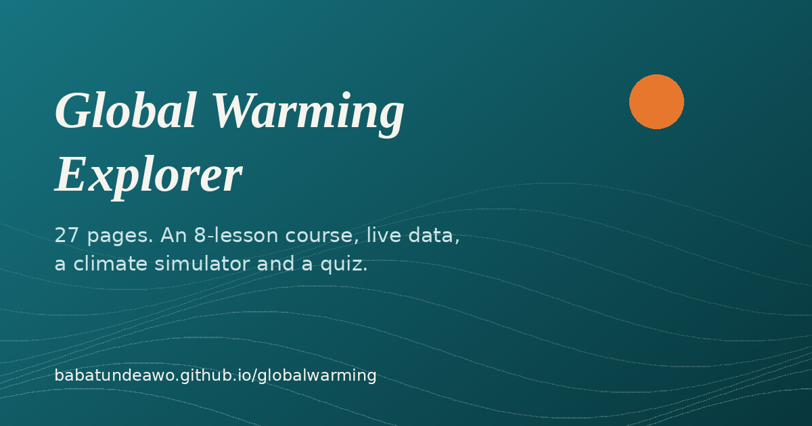

<div align="center">

<picture>
  
</picture>

# Global Warming Explorer

**A free, hands-on guide to climate science, from the greenhouse effect to what you can do about it.**

[](https://github.com/babatundeawo/globalwarming/actions/workflows/deploy.yml)
[](https://github.com/babatundeawo/globalwarming/actions/workflows/codeql.yml)

[Live site](https://babatundeawo.github.io/globalwarming/) · [Documentation](docs/CUSTOMIZING.md) · [Report an issue](https://github.com/babatundeawo/globalwarming/issues/new?template=bug_report.md)

</div>

<p align="center">
  <a href="https://babatundeawo.github.io/globalwarming/">
    
  </a>
</p>

## About

Global Warming Explorer is an interactive learning site about climate change for students, teachers and curious readers. It explains the physics of why the planet is warming, what is already happening in Nigeria and around the world, and which actions matter most. Everything is free to use, works on a phone, and can be installed and used offline.

It was written by Babatunde Ayoola Awoyemi (Techbase Consultant Services), drawing on a background in atmospheric physics and solar radiation.

## Features

- **27 pages** covering what global warming is, its causes and effects, why it matters, and how to act
- **8-lesson guided course** with objectives, worksheets and a downloadable certificate
- **Data Explorer** with live weather for any city plus the latest CO2 and global temperature records
- **Climate Simulator** where you drag a CO2 slider and watch heat get trapped
- **Carbon footprint calculator**, recycling guide, clean energy overview and an action hub
- **Quiz and glossary** for self-testing and quick look-ups
- **Classroom tools**: student check-ins, a live class dashboard and a downloadable teacher's packet (PDF)
- **Quick jump** to any page with `Ctrl/Cmd + K`, light and dark themes, and an installable offline app

## How to use it

1. Open the [live site](https://babatundeawo.github.io/globalwarming/).
2. Start with **What Is Global Warming?** for free exploration, or the **8-Lesson Course** for a guided path.
3. Try the **Simulator**, **Data Explorer** and **Quiz** to test what you have learned.
4. Teachers can find pacing guidance and the printable packet on the **For Teachers** page. Students check in to a class from the **Check-in** page, which opens a pre-filled GitHub issue.
5. To use the site offline, choose *Install* when your browser offers it.

## Tech stack

- Static HTML generated by a Python script (`build.py`), vanilla JavaScript and CSS design tokens
- [Chart.js](https://www.chartjs.org/) for charts
- [Open-Meteo](https://open-meteo.com/) for weather and geocoding, [global-warming.org](https://global-warming.org/) for CO2 and temperature series
- Service worker and web manifest for offline use
- GitHub Actions and GitHub Pages for build and hosting

## Project structure

```text
build.py          Page content and templates; generates every HTML page
css/              styles.css (base system) and brand.css (brand tokens and polish)
js/               Interactive features: quiz, simulator, charts, check-in, dashboard
images/           Icons, social preview image and profile photo
downloads/        Teacher's packet (PDF)
scripts/          Roster builder, site checker and teacher-packet generator
docs/             Guides for running and customizing the site
.github/          Workflows (deploy, CodeQL), Dependabot and issue templates
```

## Contributing

Spotted a mistake or have an idea? [Open an issue](https://github.com/babatundeawo/globalwarming/issues/new/choose). To propose a change, see [CONTRIBUTING.md](CONTRIBUTING.md).

## Security

Please report vulnerabilities privately, as described in [SECURITY.md](SECURITY.md).

## Credits

- Fonts: [Fraunces](https://fonts.google.com/specimen/Fraunces), [Inter](https://fonts.google.com/specimen/Inter) and [JetBrains Mono](https://fonts.google.com/specimen/JetBrains+Mono), all under the SIL Open Font License
- Photographs are credited beside each image and come from NASA and Wikimedia Commons under their stated licenses
- Weather data by [Open-Meteo](https://open-meteo.com/) (CC BY 4.0)
